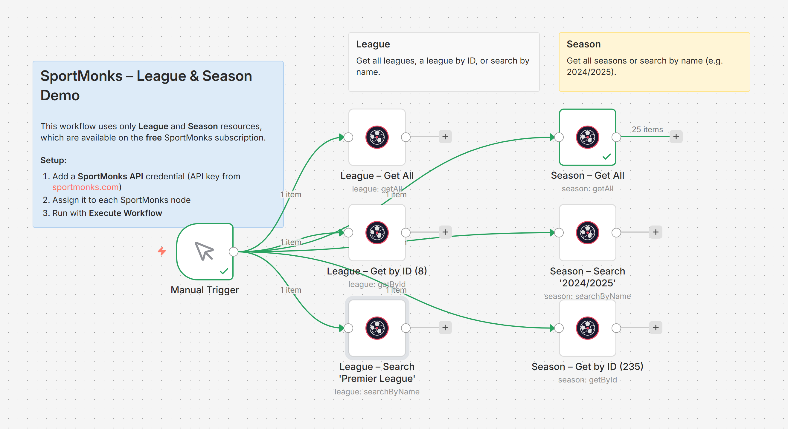
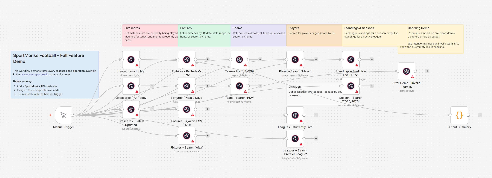
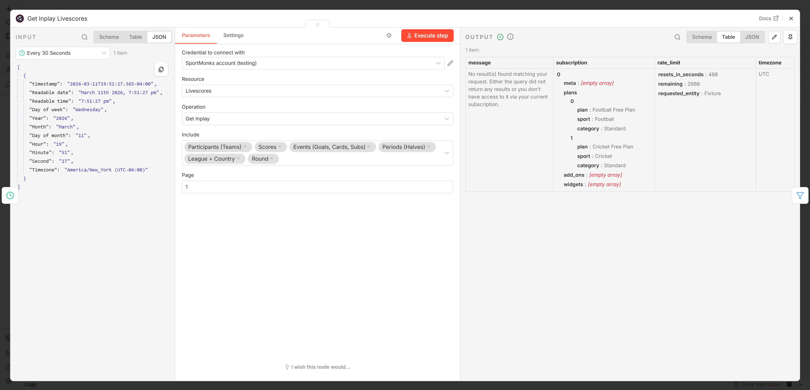
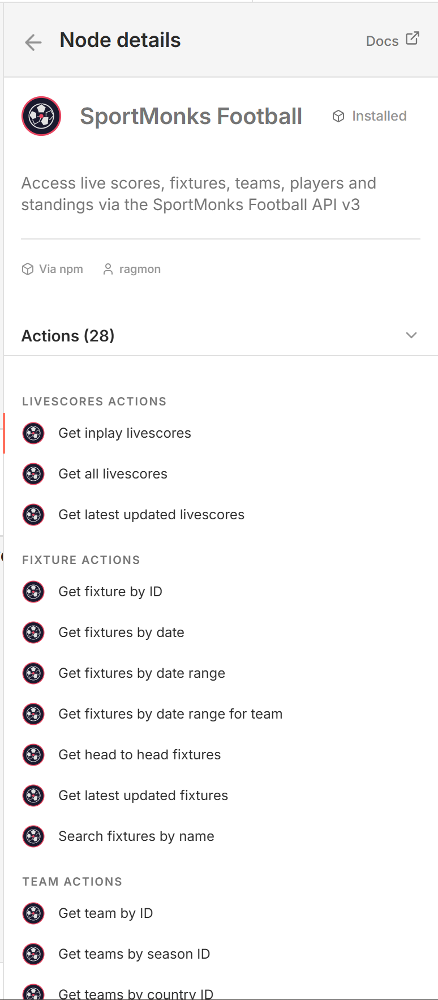

# n8n-nodes-sportmonks

[](https://www.npmjs.com/package/n8n-nodes-sportmonks)
[](LICENSE)
[](https://docs.n8n.io/integrations/community-nodes/)

A community n8n node for the **[SportMonks Football API v3](https://docs.sportmonks.com/v3/welcome/getting-started)**.

Fetch live scores, fixtures, team and player data, league standings, and much more — directly inside your n8n workflows.

---

## Features

| Resource | Operations |
|---|---|
| **Livescores** | Get Inplay · Get All Today · Get Latest Updated |
| **Fixture** | Get by ID · Get by Date · Get by Date Range · Get by Date Range for Team · Head to Head · Latest Updated · Search by Name |
| **Team** | Get by ID · Get by Season · Get by Country · Search by Name |
| **Player** | Get by ID · Get by Country · Search by Name |
| **League** | Get All · Get by ID · Get by Country · Get Live · Search by Name |
| **Standing** | Get by Season ID · Get Live by League ID |
| **Season** | Get All · Get by ID · Get by Team · Search by Name |

- **Include selector** — attach related data (participants, scores, events, periods, league, round, venue, statistics…) without extra API calls
- **Pagination** — built-in page parameter for every list endpoint
- **Error handling** — friendly messages for 401 / 403 / 429 / 500 with actionable hints
- **Continue On Fail** support — errors are captured as node output instead of stopping the workflow

---

## Prerequisites

- **n8n** ≥ 1.0.0 (self-hosted)
- A **SportMonks account** with an API token — get one free at [MySportMonks](https://my.sportmonks.com/api/tokens)

> The free plan covers Fixtures, Teams, Players, Leagues, and Standings.  
> Live scores, odds, xG, and predictions require a paid plan.

---

## Installation

### Via n8n GUI (recommended)

1. Open your n8n instance.
2. Go to **Settings → Community Nodes → Install**.
3. Enter `n8n-nodes-sportmonks` and confirm.
4. Restart n8n when prompted.

### Via npm (Docker / self-hosted CLI)

```bash
# In the ~/.n8n/nodes directory (where community nodes are stored):
cd ~/.n8n/nodes
npm install n8n-nodes-sportmonks
# Then restart n8n
```

### Via Docker Dockerfile

```dockerfile
FROM n8nio/n8n
USER root
RUN cd /usr/local/lib/node_modules/n8n && npm install n8n-nodes-sportmonks
USER node
```

---

## Configuration

### Add credentials

1. In n8n open **Settings → Credentials → New Credential**.
2. Search for **SportMonks API**.
3. Paste your API token from [MySportMonks](https://my.sportmonks.com/api/tokens).

---

## Usage

After installing the node and adding credentials, search for **"SportMonks Football"** in the node panel.

### Quick example — get live scores with team names and current score

```
Trigger → SportMonks Football (Livescores / Get Inplay, Include: participants;scores)
```

The node outputs one item per live fixture. Each item contains the raw SportMonks API data for that match.

### Include selector

Most endpoints support includes — related data bundled in the same API call:

| Include value | What it adds |
|---|---|
| `participants` | Both teams with meta (home/away, winner) |
| `scores` | Goals per half + current total |
| `events` | Goals, cards, substitutions, VAR |
| `periods` | Half timestamps, ticking status |
| `league` | League name and image |
| `league.country` | League + country details |
| `round` | Round name and dates |
| `venue` | Stadium info |
| `statistics` | Match or season statistics |
| `lineups` | Starting XI and bench |

---

## Example Workflows

See [`workflows/`](workflows/) for importable workflow JSON files:

| Workflow | Description |
|---|---|
| `demo-all-features.json` | Demonstrates every resource and operation with sticky-note explanations |
| `demo-league-season.json` | League & Season only — works with the free SportMonks subscription |
| `livescore-monitor.json` | Polls inplay scores every 30 seconds and formats a live match report |

To import: **Workflows → Import from file** in your n8n instance.

### Screenshots

| Screenshot | Description |
|------------|-------------|
| [](docs/screenshots/01-workflow-league-season-demo.png) | **League & Season demo** — Free-tier workflow with Get All, Get by ID, and Search for League and Season |
| [](docs/screenshots/02-workflow-full-feature-demo.png) | **Full feature demo** — All resources (Livescores, Fixtures, Teams, Players, Leagues, Standings, Seasons) with sticky notes |
| [](docs/screenshots/03-node-livescores-execution.png) | **Livescores node** — Get Inplay configuration and output (subscription info when no live games or on free plan) |
| [](docs/screenshots/04-node-details-actions.png) | **Node details** — SportMonks Football node in n8n: description, source, and list of 28 actions |

All screenshots are in [`docs/screenshots/`](docs/screenshots/).

---

## API Reference

- [Authentication](https://docs.sportmonks.com/v3/welcome/authentication)
- [Endpoints overview](https://docs.sportmonks.com/v3/endpoints-and-entities/endpoints)
- [Entities](https://docs.sportmonks.com/v3/endpoints-and-entities/entities)
- [Getting Started](https://docs.sportmonks.com/v3/welcome/getting-started)
- [Rate Limits](https://docs.sportmonks.com/v3/api/rate-limit)
- [Error Codes](https://docs.sportmonks.com/v3/api/error-codes)

---

## Development

```bash
git clone https://github.com/ragmon/n8n-nodes-sportmonks.git
cd n8n-nodes-sportmonks
npm install
npm run build       # compile TypeScript → dist/
npm run dev         # watch mode
npm run lint        # type check only
```

To test locally with a running n8n instance, symlink the package:

```bash
cd ~/.n8n/nodes
npm install /path/to/n8n-nodes-sportmonks
# restart n8n
```

---

## Contributing

Contributions are welcome! Please read [CONTRIBUTING.md](CONTRIBUTING.md) before submitting a pull request.

---

## Changelog

See [CHANGELOG.md](CHANGELOG.md).

---

## License

[MIT](LICENSE) © Arthur Rahimov
